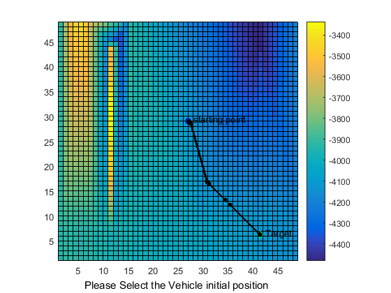

# DEM Generation and Local and Global Path Planning for Lunar Rover

    <em>Fig: Sample Local Path Plan for lunar rover</em>

Find in 

## Instructions
### DEM generation
* Process NAC images in USGS ISIS and Ames Stereo Pipeline.
* Generate point cloud and obtain the .las format.
* Convert .las format into .csv using liblas library for importing to MATLAB.
* Checkout the Pg 6-28 of the [doc](https://github.com/chandrabhraman/lunar-rover-path-planning-/blob/main/path%20planning%20summary%20final.pdf) for more details

### Global path planning using coarse map data generated with DEMs
* Identify the all the cost functions.
* Plan the starting point.
* Plan the end point.
* Choose an algorithm for cost minimization from starting to end point and implementing.

### Local path planning using stereo images from rover
* Pan the area using the stereo imaging.
* Map the ROI based on the imaging function.(cam2map)
* Identify the obstacles in image of minimum threshold and generate a field map based on obstacles.
* Identify the end point of traversal.
* Choose an algorithm for minimizing identified cost and implement for generating way points.
* Drive to the way points

